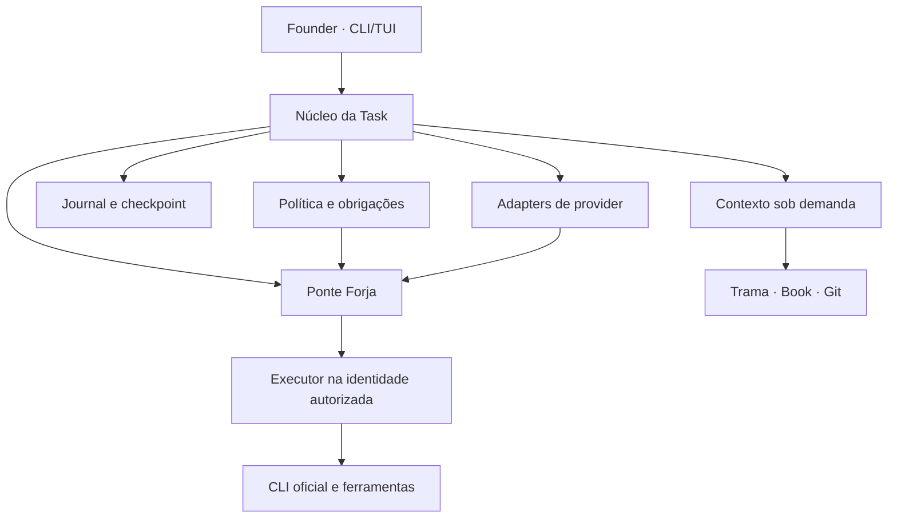
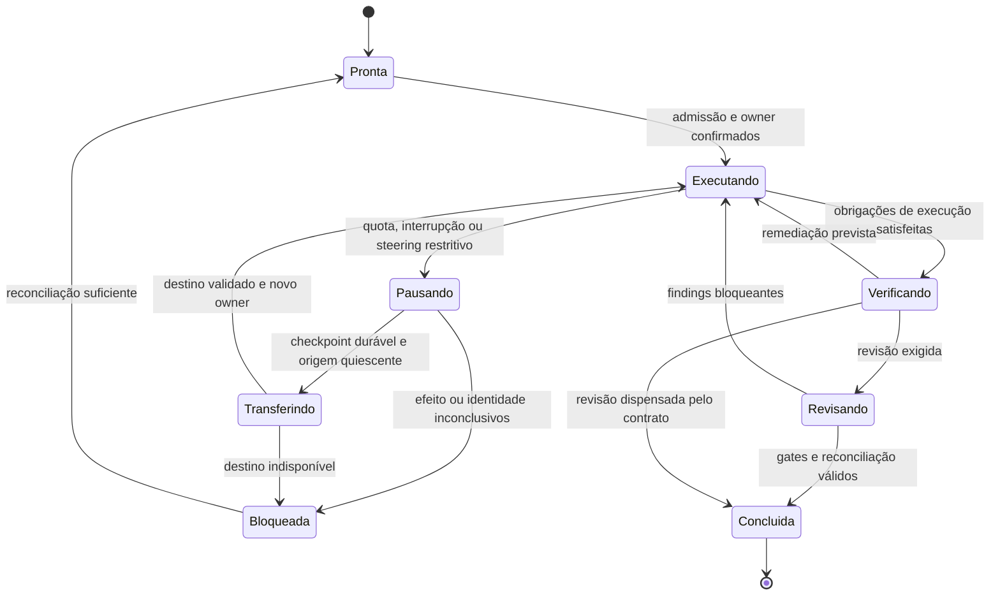

# Arquitetura proposta do Pinker Harness

Status: **PROPOSTA COM DIRETRIZES DE PERSISTÊNCIA ACEITAS PELA FOUNDER**. Documento preparado em 2026-09-15 a partir das autoridades e do código abaixo. Em continuidade, a Founder aceitou estado persistente, com supervisor duradouro condicionado à necessidade, e determinou recuperação seletiva orientada a Tasks e ausência de arquivos operacionais Markdown. A seção 16 registra essas diretrizes e distingue as propostas de mecanismo ainda sujeitas a validação. O documento não declara H0.1–H0.7 executados nem aprovação integral de todas as escolhas de implementação.

## 1. Base factual e precedência

| Fonte inspecionada | Estado e consequência |
| --- | --- |
| [Issue #1](https://github.com/LyannaValerie/pinker-harness/issues/1), incluindo seu comentário | Autoridade canônica: CLI/TUI, Task acima de sessão/provider, divisão de responsabilidades e sequência H0. |
| [Issue #2](https://github.com/LyannaValerie/pinker-harness/issues/2), incluindo os quatro comentários presentes na leitura | Contrato P0, relatos reais de assinatura, correção da classificação de quota e descoberta da fronteira de identidade. |
| [Issue #3](https://github.com/LyannaValerie/pinker-harness/issues/3) | Fechada, VOID e sem autoridade. |
| [PR #4](https://github.com/LyannaValerie/pinker-harness/pull/4) | Integrada. Origem do probe de autenticação. |
| [PR #5](https://github.com/LyannaValerie/pinker-harness/pull/5), diff e review | Aberta no HEAD `2ae88cb18ee0146eef68f8ae8ba121e1433756a7`; failover real relatado como PARTIAL. |
| [main](https://github.com/LyannaValerie/pinker-harness/tree/3aff5a92f6bbbdeb81833351406f0885fd91128d) | Baseline `3aff5a92f6bbbdeb81833351406f0885fd91128d`; probe Python, documentação curta, teste de roteamento e evidência de uma execução. |
| [Origem pinker-v0#594](https://github.com/LyannaValerie/pinker-v0/issues/594), incluindo transferência final | Registro histórico encerrado. Requisitos herdados continuam válidos quando preservados pela #1; congelamento pela campanha #442 e localização `/rosa-harness` foram revogados. |

As árvores de main e da PR #5 inspecionadas não contêm `AGENTS.md`. Não foi inventariada a Forja real nesta análise. Não havia `pink`, Codex ou Claude utilizáveis para executar integração neste ambiente; a inspeção remota e os testes Python isolados são o fallback de navegação. Nenhum comportamento atual da Engine, da Trama ou do Book é inferido de lembranças de conversa.

Classificação usada neste documento: **confirmado no código/testes**, **documentado**, **inferência**, **proposta** e **desconhecido**. Todas as seções de desenho a partir da seção 3 são propostas, salvo identificação explícita de fonte ou contrato herdado.

### 1.1 O que já está provado e o que continua aberto

| Afirmação | Classificação | Limite |
| --- | --- | --- |
| Há relatos reais de assinatura funcional OpenAI e Anthropic em `amara`, e OpenAI em `velina`. | Documentado na [evidência da Founder](https://github.com/LyannaValerie/pinker-harness/issues/2#issuecomment-5679393258). | Não reexecutado nesta análise; não prova disponibilidade futura. |
| `velina/Anthropic` tinha autenticação válida e quota esgotada. | Documentado no [finding de quota](https://github.com/LyannaValerie/pinker-harness/issues/2#issuecomment-5679541197). | Uma requisição bloqueada por quota não verifica a execução pretendida. |
| Selecionar `claude-amara` do contexto corrente não conseguiu concluir o failover. | Documentado no [finding de identidade](https://github.com/LyannaValerie/pinker-harness/issues/2#issuecomment-5679744239) e confirmado quanto ao mecanismo no código da PR #5. | Não invalida o sucesso anterior executado como usuário `amara`. |
| A PR #5 executa a segunda tentativa trocando o wrapper. | Confirmado em `attempt_anthropic` e `provider_route`. | Não há nesse código prova de troca de UID, sessão de usuário ou contexto legítimo de autenticação. |
| A Forja consegue transferir uma Task entre identidades preservando seus recursos e revogando o executor anterior. | Desconhecido. | É requisito do inventário, não capacidade já demonstrada. |

A arquitetura deve preservar três separações: autenticação/disponibilidade, Task/sessão e rota do provider/identidade de execução. Não se pode transformar a seleção de um nome de executável em prova de troca de conta.

## 2. Consequências imediatas para os probes

Preservar o P0 como experimento independente. Não promover suas allowlists, regexes e dataclasses diretamente a contratos definitivos do produto.

Na cópia dos arquivos do HEAD da PR #5, `python3 -m unittest discover -s probes -v` terminou com código 0: **10 testes passaram**. Eles verificam lógica local; o sucesso da tentativa de destino é simulado e não atravessa uma fronteira de usuário do SO.

Três verificações adversariais adicionais, sem conta nem rede, reproduziram:

| Entrada/caminho | Resultado atual | Requisito arquitetural |
| --- | --- | --- |
| `classify_failure(1, "quota service unavailable")` | `QUOTA_EXHAUSTED` | Exigir evidência específica de limite; a palavra quota não basta. |
| Resposta JSON com `is_error=true`, código 0 e marcador dentro do texto de erro, via `attempt_anthropic` com transporte simulado | `RequestStatus.PASS` | Validar envelope terminal, erro, papel/campo da resposta e igualdade do marcador esperado. |
| `sanitize_message(b"partial output", b"timeout")` | `TypeError` | Normalizar bytes/texto na fronteira do transporte, inclusive saídas parciais de timeout. |

Outros pontos confirmados por leitura: `p0_auth` mantém uma classificação genérica de falha da requisição mesmo na PR #5; `Attempt.auth` mistura ausência de wrapper com ausência de suporte; e um JSON de runtime já rastreado em main continuará rastreado apesar do novo `.gitignore`. O tratamento desse artefato histórico exige decisão própria, não exclusão implícita nesta proposta.

A conclusão é **P0 útil e incompleto para continuidade**. Repetir um marcador em outra chamada demonstra uma etapa de transporte; não demonstra retomada de uma Task que já editou arquivos, iniciou processos ou produziu efeitos remotos.

## 3. Decisão principal

Construir um **monólito modular em Python**, iniciado pelo shell na Forja, com uma interface interativa fina, um núcleo determinístico orientado a Task e processos efêmeros dos CLIs oficiais. O núcleo persiste fatos da execução e coordena autoridades existentes.

O harness controla seleção, contexto, supervisão e continuidade. O CLI do provider conserva seu loop interno de interação com o modelo e suas ferramentas oficiais. Não se implementa um segundo loop genérico de ferramentas sobre o primeiro. Operações que precisem de autoridade externa passam por uma ponte controlada e auditável.



As caixas são responsabilidades, não microserviços. Um processo de controle por Task basta inicialmente. O mecanismo confiável de lançamento/troca de identidade pertence à Forja; não é um daemon privilegiado novo embutido na TUI.

### 3.1 Alternativas consideradas

| Alternativa | Avaliação |
| --- | --- |
| Automação de TUI por scraping/PTY | Frágil para quota, permissões e reconciliação; rejeitada como protocolo de controle. TTY continua possível para login oficial humano. |
| Framework agentic genérico com memória e scheduler próprios | Duplica responsabilidades já atribuídas a Forja/Book/Trama e aumenta dependências; rejeitado na fundação. |
| Núcleo inteiro em Rust desde H0 | Possível, mas não resolve o desconhecimento de identidade/transporte e aumenta custo inicial; não recomendado agora. |
| Python modular com contratos versionados e transporte oficial | Recomendado: aproveita os probes e permite validar integração antes de estabilizar uma fronteira adicional de linguagem. |

Rust entra somente quando um componente demonstrar necessidade concreta: validação robusta de estado, processamento de protocolo ou fronteira sensível claramente isolável. C fica reservado a probes POSIX/FFI/recursos realmente necessários. Não criar diretórios vazios de Rust/C nem manter duas implementações normativas dos mesmos contratos. Shell permanece glue de entrada.

## 4. Autoridades e componentes

| Responsabilidade | Autoridade | O que o harness faz |
| --- | --- | --- |
| Direção, identidade, alteração de contratos e ações humanas reservadas | Founder | Registra decisões explícitas com proveniência e revisão. |
| Ambiente, Task root, worktree, target, tmp, artifacts, isolamento, lifecycle e identidade de execução | Forja | Consome descritor factual, solicita operações permitidas e confere receipts. |
| Estado corrente e histórico do código | Git/repositório | Consulta HEAD, índice, diff, arquivos e checks para ligar evidência à candidata exata. |
| Navegação estrutural da Pinker | Trama | Consulta sob demanda; não cria repo-map concorrente. |
| Precedentes operacionais validados | Book | Recupera casos e registra uso/retention pelo contrato existente. |
| Obrigações, escopo, gates e condições de parada | Contrato da Task | Valida e aplica transições mecânicas; não inventa obrigação nem dispensa gate. |
| Verificação determinística dos contratos que lhe cabem | Guardião Pinker | Invoca e registra resultados; não substitui sua semântica por julgamento do modelo. |
| Sessões, provider, quota reativa e continuidade factual | Pinker Harness | Coordena componentes sem assumir suas autoridades. |

Engine permanece o produto técnico objeto das Tasks. Rosa permanece identidade/direção, sem virar nome de um executor operacional ou fonte autônoma de aprovação. O harness não modifica o compilador por analogia com sua arquitetura.

Organização proposta, criada somente à medida que cada fatia precisar:

| Módulo | Entrada → saída |
| --- | --- |
| `pinker_harness/ui` | Intenção humana → comandos do núcleo; eventos → visualização. |
| `pinker_harness/task` | Contrato, observações e comando → transição validada e próxima obrigação. |
| `pinker_harness/policy` | Efeito solicitado, grants e escopo → permitir, negar ou exigir decisão humana concreta. |
| `pinker_harness/providers` | Mensagens de domínio ↔ transportes oficiais, eventos normalizados e matriz de capacidades. |
| `pinker_harness/accounts` | Slots autorizados e observações → seleção explicável e cooldown. |
| `pinker_harness/forja` | Solicitação de ambiente/execução/transferência → receipt da Forja. |
| `pinker_harness/context` | Necessidade de informação → pacote mínimo com fontes, revisões e orçamento. |
| `pinker_harness/integrations` | Requisições de Trama/Book/Git/Guardião/GitHub → resultados tipados e referências. |
| `pinker_harness/evidence` | Eventos factuais → journal, checkpoint e receipt verificáveis. |
| `pinker_harness/review` | Obrigação de revisão e candidata → sessão efêmera, findings e estado de remediação. |

O núcleo depende de interfaces, não dos formatos particulares dos providers. A TUI não chama subprocessos diretamente. Adapters não escolhem contas nem completam Tasks por conta própria. Não criar sistema de plugins genérico nesta etapa.

## 5. Modelo de domínio e contratos

| Objeto | Conteúdo e invariante |
| --- | --- |
| `TaskEnvelope` | ID estável, origem, revisão/hash do contrato, objetivo, baseline, escopo permitido/proibido, obrigações, gates, stops, política de rede, providers/modelos/modos autorizados e orçamento. Não contém segredos. |
| `ForjaBinding` | Referências do ambiente, generation, worktree/target/tmp/artifacts e mecanismos disponíveis. É fornecido/validado pela Forja, não montado por concatenação de caminhos presumidos. |
| `ExecutionIdentity` | Identidade efetiva do SO/ambiente e referência do contexto de execução autorizado. Inclui evidência observada, não só nome solicitado. |
| `AccountSlot` | Provider, perfil oficial opaco, binding de identidade, modo de uso, autenticação, disponibilidade, quota e ocupação. Até cinco contas, conforme requisito herdado; slots de conta não são slots de worktree. |
| `ProviderRoute` | Executável/transportes/configuração admitidos para o slot. Não é credencial e não prova identidade. |
| `AgentSession` | ID efêmero, papel, Task, slot, identidade, capabilities, revisão de contexto e IDs opacos de transporte. Descartável sem perda da Task. |
| `OwnershipLease` | Referência ao owner/generation concedidos pela Forja, validade e eventual token de fencing. Não cria um segundo cadastro de ownership. |
| `OperationIntent` | ID, efeitos, argumentos/referências saneados, precondições, contrato/policy vigentes e regra de repetição. |
| `EvidenceRef` | Emissor, origem, instante, SHA/hash relevante, caminho de artefato, resultado e classificação factual. |
| `Checkpoint` | Projeção factual consistente até um número do journal; estado de arquivos/processos, passos, blockers, decisões e obrigações restantes. |
| `TaskReceipt` | Conclusão derivada de evidência, gates, revisão, Git e reconciliação, com pendências e limitações explícitas. |

Não codificar `amara` e `velina` no domínio definitivo. A admissão de participantes vem da autoridade/configuração da Forja. Preservar a allowlist dos probes até existir uma substituição autorizada e demonstrada.

### 5.1 Quatro eixos de estado do provider

Há uma ambiguidade real a resolver em H0.2: o contrato inicial usa `SUBSCRIPTION_LOGIN = PASS | DISCARDED`; o comentário posterior reserva `DISCARDED` à falta de suporte oficial; e a PR #5 introduz `NOT_AUTHENTICATED`/`UNSUPPORTED`. A recomendação é manter o veredito binário de admissão separado do estado de uma tentativa.

| Eixo | Valores propostos | Interpretação |
| --- | --- | --- |
| Capacidade do provider | `SUPPORTED`, `UNSUPPORTED`, `UNVERIFIED` | Suporte oficial na versão/superfície examinada. |
| Autenticação no contexto observado | `AUTHENTICATED`, `NOT_AUTHENTICATED`, `AUTH_NOT_VISIBLE`, `UNKNOWN` | Sempre vinculada a slot + identidade + instante; não invalida outra identidade. |
| Disponibilidade | `AVAILABLE`, `QUOTA_EXHAUSTED`, `RATE_LIMITED`, `PROVIDER_UNAVAILABLE`, `UNKNOWN` | Limite transitório de requisições e quota esgotada não são automaticamente equivalentes. |
| Resultado da requisição | `PASS`, `BLOCKED_BY_QUOTA`, `FAIL`, `NOT_ATTEMPTED`, `UNKNOWN_EFFECT` | A operação aconteceu? Uma interrupção pode impedir saber. |

O veredito P0 concluído continua `PASS | DISCARDED`. Não emitir `DISCARDED` para falta de wrapper, timeout, cancelamento de login, quota ou credencial invisível no contexto corrente. Enquanto não houver evidência suficiente, registrar a avaliação como não concluída, sem fabricar um veredito. `PASS` de autenticação nunca implica `PASS` da operação mínima.

Observabilidade tem duas dimensões: capacidade (`SUPPORTED | UNSUPPORTED`) e leitura atual (`OBSERVED | UNAVAILABLE | STALE | NOT_REQUESTED`). Isso preserva o caso Codex: transporte documentado, leitura local indisponível. Cada janela guarda identificador, duração, utilização, reset, origem e `observed_at`. Modelo solicitado e modelo efetivamente observado são campos distintos; ausência de observação não autoriza preencher com configuração ou autoafirmação do modelo.

H0.2 deverá documentar a migração de nomes e uma versão de schema. Os JSONs antigos continuam legíveis com sua semântica original; ausência de campos não vira sucesso, e migração nunca inventa uma identidade ou um modelo.

## 6. Provedores: transporte e capacidades

**Codex:** candidato preferido é `codex app-server` com stdio/JSONL, inicialização negociada, IDs de requisição e leitura contínua de notificações. A documentação oficial descreve `turn/start`, `turn/steer`, `turn/interrupt`, pedidos de aprovação e `account/rateLimits/read`. `codex exec --json` fica como transporte delimitado para probes/fallback autorizado, sem fingir equivalência de capacidades. Fonte: [Codex App Server](https://learn.chatgpt.com/docs/app-server).

**Claude Code:** candidato inicial é o CLI oficial em print mode com entradas/saídas estruturadas; a referência documenta `stream-json` e `--no-session-persistence`. Hooks `PreToolUse` são uma superfície de decisão anterior à ferramenta, mas exigem teste de cobertura e falha. Não assumir que o protocolo de permissões do SDK tem a mesma modalidade de assinatura do CLI. Fontes: [CLI reference](https://code.claude.com/docs/en/cli-reference) e [Hooks reference](https://code.claude.com/docs/en/hooks).

Essas são confirmações documentais de superfícies, não provas da versão instalada na Forja. Flags exatas, schema, permissões, quota e comportamento sob assinatura precisam de H0.1. Não ler protocolo privado, raspar TUI, implementar OAuth próprio nem adotar MCP como arquitetura alternativa à divisão aprovada.

Interface interna conceitual: descobrir capacidades, observar autenticação, iniciar sessão, enviar entrada, receber eventos, interromper, encerrar, observar limites e responder solicitações de decisão quando suportado. Isso não é uma nova CLI pública nem uma afirmação de que todos os métodos existem nos dois providers.

Regras do adapter:

1. Vincular cada evento a sessão/turno/operação; um evento atrasado não pode concluir a sessão atual.
2. Normalizar bytes, texto, JSON, erros, timeout, cancelamento e término inesperado; limitar tamanho/fila e preservar diagnóstico útil.
3. Confirmar sucesso somente por resultado terminal válido. Marcador presente em prompt, stderr, tool output ou erro não conta.
4. Separar canal de controle de texto gerado. Texto dizendo “autorizado” ou “quota esgotada” não tem autoridade de protocolo.
5. Encaminhar login ao fluxo oficial sob a identidade correta; não transportar segredos pelo journal nem reaproveitar cache por cópia.
6. Usar sessão nova e impedir importação automática de memória/transcript. Inventariar memória automática, hooks e configs de usuário do próprio CLI; não desabilitar política válida junto com histórico.
7. Negociar capacidades, guardar versão e referências dos schemas; mudança incompatível bloqueia somente as operações afetadas. Campo desconhecido sem efeito de autoridade pode ser ignorado com diagnóstico; mensagem de autorização desconhecida não concede permissão.

Uma capacidade precisa carregar evidência: documentada, comprovada localmente ou desconhecida. A TUI só promete steering imediato quando comprovado; caso contrário, registra a entrada como enfileirada e a entrega no próximo limite seguro. Nenhum fallback muda assinatura para API, modelo ou permissões silenciosamente.

## 7. Execução e identidade: fronteira com a Forja

O `AccountSlot` indica qual contexto legítimo usar; a Forja materializa esse contexto. O harness solicita a execução, recebe um handle e verifica a identidade efetiva e os acessos necessários antes de consumir quota.

O contrato mínimo exigido da ponte Forja é:

- descrever uma Task existente e seus recursos, sem criar uma Task paralela no harness;
- iniciar processo sob identidade autorizada, com cwd, ambiente e permissões determinados;
- observar identidade efetiva, processo/grupo e geração;
- interromper e confirmar quiescência, incluindo filhos que ainda poderiam escrever;
- transferir ownership ou recusar explicitamente a transferência;
- fornecer acesso controlado aos mesmos artefatos e worktree para a identidade sucessora;
- reconciliar uma transferência interrompida após queda do supervisor.

Essas são operações lógicas exigidas. Os comandos reais ainda precisam ser descobertos. Se a Forja não os oferecer, registrar gap e propor evolução nela, sob contrato próprio. Não improvisar `sudo`, `su`, troca de `HOME`, symlinks de autenticação ou cópia de tokens dentro do harness.

**Invariante:** existe no máximo um owner com permissão efetiva de escrever na mesma Task. O número de generation no JSON ajuda a detectar eventos velhos; sozinho não impede um processo antigo de escrever. A garantia requer fencing efetivo ou encerramento confirmado dos processos e revogação de acesso antes de entregar a escrita ao sucessor.

A coordenação deve sobreviver à identidade do provider. Pode permanecer no contexto de controle da Task, se a Forja já o suportar, ou ser retomada por um novo controlador depois da transferência. A escolha física depende do inventário; em ambos os casos, há um único escritor do journal e nenhuma dependência de um supervisor LLM permanente.

## 8. Continuidade, pausa e failover

Estado da execução mantido pelo harness é uma projeção própria de coordenação, referenciada ao lifecycle da Forja, não um lifecycle concorrente de worktrees.



Cancelamento e falha terminal são saídas explícitas em qualquer fase, com quiescência e receipt parcial; nunca são `Concluida`. Uma correção da Founder que altere escopo/gates produz nova revisão do contrato antes da próxima ação afetada. Se revogar autorização de uma ação em andamento, interromper e reconciliar seus efeitos, em vez de aguardar silenciosamente o próximo turno.

### 8.1 Protocolo de transferência

1. Registrar o gatilho e suspender novas ações mutáveis. A observação de quota não muda autenticação.
2. Interromper a sessão pelo transporte oficial; pedir à Forja que confirme término/quiescência. Não esperar que um modelo sem quota escreva um handoff final.
3. Reconciliar comandos, processos, arquivos e efeitos remotos iniciados. Uma resposta perdida deixa a operação inconclusiva até consulta da autoridade correspondente.
4. Persistir journal e checkpoint factual. Registrar HEAD, índice, alterações não commitadas, arquivos novos permitidos, probes temporários e obrigações restantes. Não criar commit automático apenas para trocar conta.
5. Escolher um slot elegível por política explícita e observações recentes. Se não houver destino, manter a Task pausada com motivo e possível reset; sem loop de chamadas pagas.
6. Solicitar à Forja a transferência e acesso ao ambiente preservado. Confirmar identidade efetiva, generation, revisão do contrato e snapshot esperado.
7. Validar autenticação no contexto de destino, criar sessão limpa e fornecer o pacote factual mínimo. A origem permanece bloqueada para escrita.
8. Retomar da próxima obrigação não comprovada; registrar a ativação do novo owner. Não repetir automaticamente a última mensagem completa do modelo.

Não há transação atômica única entre SQLite, filesystem, Forja e providers. Cada etapa precisa ter intent durável, resultado e reconciliação idempotente. Se houver queda depois de a Forja transferir ownership e antes do registro local, consultar a Forja antes de tentar transferir novamente. Transferência parcial termina em estado explícito, nunca em dois owners.

### 8.2 Política reativa de contas

Filtrar por provider/modalidade autorizados, capacidade, identidade atingível, autenticação contextual, exclusões e ocupação. Preferir a conta atual enquanto utilizável; depois, outra conta do mesmo provider quando isso reduzir custo de migração; depois, outro provider explicitamente permitido. A disponibilidade real pode prevalecer sobre essa preferência.

Usar quota somente com origem e validade temporal. Percentuais de janelas/produtos diferentes não formam uma escala universal; token local não estima porcentagem da assinatura. Na falta de telemetria, trabalhar com `UNKNOWN`, retorno real de limite e eventual informação humana identificada. Configurar limite de tentativas e cooldown; reset informado é ocasião para reavaliar, não prova automática de disponibilidade.

Sem previsão de custo como scheduler central, sem reserva fixa 80/20 e sem supor que revisão custa pouco. A revisão obrigatória continua obrigação quando falta quota: a Task aguarda ou transfere a obrigação.

## 9. Estado durável, evidência e contexto

Preferir **SQLite como armazenamento transacional do journal da Task e de suas projeções**, dentro de um diretório de artifacts durável fornecido pela Forja. Não é um banco de memória de agente nem uma base de conhecimento concorrente do Book. O journal guarda fatos de execução; Book continua a autoridade de conhecimento reutilizável validado.

Um escritor confiável por Task atualiza eventos e projeções numa transação. Event journal é append-only na API normal; checkpoint aponta para `journal_seq`, versão e hash do contrato. JSON/JSONL são formatos de exportação/intercâmbio, não uma segunda fonte de verdade gravada em paralelo. A escolha de modo de journal e sincronização do SQLite depende do filesystem real; não presumir suporte adequado em armazenamento remoto.

Artefatos maiores ficam em arquivos referenciados por hash. Publicar arquivo completo e durável antes de registrar a referência; uma queda pode deixar artefato órfão recuperável, não receipt apontando a arquivo parcial. Exportar checkpoint por escrita temporária + substituição atômica no mesmo filesystem. Retenção segue Forja/Task; falha de armazenamento impede continuar uma mutação que exija evidência durável. `/tmp` não é destino final aceitável para continuidade. Conforme decisão posterior da Founder, nenhum estado, prompt persistido, contrato operacional ou memória próprios do harness será armazenado em `.md`; ver seção 16.

Envelope mínimo de evento: versão, `event_id`, `task_id`, generation, sessão, sequência, tipo, instante UTC, emissor, correlação de operação, contrato/policy, fatos e referências de evidência. Duração e timeout usam relógio monotônico; ordem e causalidade não dependem só do relógio de parede.

Separar emissores: controlador, Forja, adapter, ferramenta/gate e relato do agente. Uma afirmação do agente pode entrar como finding proposto; não como comando comprovadamente executado ou gate aprovado. Hash prova integridade do conteúdo registrado, não a veracidade de uma alegação. Journal, política e receipts devem ficar fora da permissão de escrita do executor não confiável.

### 9.1 Conteúdo do checkpoint

- Task, revisão/hash do contrato, generation e referências de ownership;
- baseline/HEAD e estado do índice/working tree, manifesto de arquivos alterados e novos pertinentes;
- bindings Forja, processos/operações pendentes e estados de efeitos externos;
- passo atual, último passo comprovado e próximas obrigações;
- decisões humanas aceitas, findings classificados, blockers e remediações;
- referências de Trama/Book já consumidas, gates, revisões e runs remotos;
- identidades/slots usados e estado de disponibilidade observado;
- fontes, hashes, `journal_seq` e limites de validade das evidências.

HEAD sozinho é insuficiente: pode haver diff não commitado, índice diferente e arquivos novos. O registro precisa permitir verificar o estado preservado pela Forja sem ler indiscriminadamente arquivos excluídos ou segredos. Não reconstruir arquivos do projeto a partir de prosa do modelo.

### 9.2 Contexto mínimo e amnésia

Cada sessão recebe contrato vigente, identificação da Task, checkpoint factual pertinente e instruções para consultar autoridades. Resultados selecionados de Trama, Book, journal e repositório entram por necessidade, com revisão, fonte, bytes servidos e orçamento. Contratos obrigatórios nunca são truncados para caber no orçamento; reduzir evidência auxiliar ou decompor a Task.

Não importar transcript integral, memória automática de outra sessão ou raciocínio privado. Reutilizar autenticação é independente de reutilizar conversa. Eventos de reasoning/thinking recebidos do transporte não são persistidos nem transferidos; respostas públicas úteis só entram como conteúdo autorizado e classificado. Logs brutos não são guardados indiscriminadamente para depois tentar retirar segredos por regex.

O cache do harness armazena referências e resultados com validade, não outra cartografia nem memória semântica. Uma alteração relevante invalida a evidência correspondente. Guardar o recibo do uso de Book evita repetir pesquisas e não substitui a atualização canônica do Book quando exigida.

## 10. Enforcement determinístico e autonomia

Os modos herdados `OBSERVE`, `WORK` e `ELEVATED` descrevem conjuntos de efeitos permitidos, não filtros de assunto. Problemas de CI, Git, shell, container, rede e dependências podem ser investigados quando necessários à Task. Descobrir uma capacidade desconhecida não amplia a autorização para exercê-la.

| Modo | Política recomendada |
| --- | --- |
| `OBSERVE` | Leitura do escopo autorizado; escrita apenas de estado operacional e artefatos explicitamente previstos. Compilar/testar não é automaticamente read-only. |
| `WORK` | Edição, builds, testes, ferramentas e Git local delimitados pela Task, incluindo target/tmp autorizados e operações remotas concedidas pelo contrato. Sem confirmação por comando rotineiro. |
| `ELEVATED` | Efeitos fora desse conjunto, ações destrutivas e publicação/merge/release exigem autorização humana vinculada à ação concreta. Não é “modo root” ou bypass global. |

Admissão em WORK exige evidência das barreiras efetivas. Prompt, retorno final e inspeção de diff não impedem um efeito que já aconteceu. A combinação necessária é política do harness, controles oficiais do provider, isolamento da Forja e mediação das operações sensíveis.

Regras centrais:

- Grants identificam recurso/ação, revisão de contrato, limites e validade; não são aprovados pelo próprio agente. Uma concessão vigente é reutilizada sem perguntar de novo.
- Configuração de política, executáveis do controle, hooks mandatórios e receipts ficam fora da escrita autorizada ao owner. Arquivo alterável pela candidata não pode se autoconceder permissão.
- Shell arbitrário autorizado pode causar efeitos não visíveis como uma chamada de ferramenta especializada. Regex de prefixos e allowlist de caminhos não bastam para garantir isolamento; testar subprocessos, symlinks, escrita indireta e egress reais.
- Operações remotas sensíveis usam a autoridade/ponte apropriada. Sem controle efetivo de credenciais e egress, não alegar que ocultar `gh` ou negar uma string bloqueia um merge via outro cliente.
- Se o CLI e ferramentas arbitrárias compartilham UID com acesso a cache de credenciais, hooks não provam confidencialidade desse cache. H0.1 deve identificar o isolamento real que permite autenticação oficial sem expor segredos às ferramentas; se insuficiente, restringir a capacidade afetada e registrar o gap.
- Timeout ou erro do verificador não conta como permissão, gate PASS ou defeito do produto. Negar/parar a operação afetada com diagnóstico do harness.
- Resultado de ferramenta, issue, documento externo ou texto do modelo não pode se promover a decisão da Founder. Proveniência de controle deve ser distinta do conteúdo de trabalho.

Para o primeiro WORK, não basta “hook configurado”: executar casos conhecidos permitidos e proibidos na versão real do provider e da Forja. Se a combinação não suportar uma fronteira obrigatória, manter esse adapter em OBSERVE até resolver o gap. Não construir sandbox genérico próprio como atalho.

## 11. Gates, revisão e conclusão

O modelo padrão herdado é um owner por Task e revisão efêmera quando a obrigação/política a exigir. Não há par permanente PRIMARY/REVIEWER. Paralelismo de agentes exige escopos/obrigações explícitos e autorização aplicável; não é default do produto.

Revisão lê uma candidata estabilizada, com identidade de conteúdo definida. Preferir diversidade de provider quando útil e disponível; dois processos não são prova automática de independência técnica. O reviewer registra findings e evidências, sem corrigir durante a revisão. Remediações pertencem a uma etapa de execução posterior.

Um gate registra comando/versão, cwd, código de saída, ambiente relevante, artefatos e identidade da candidata. A chave de validade inclui conteúdo, contrato e configuração do verificador. Mudança depois do gate/review torna o resultado stale, salvo regra explícita que prove equivalência ou delimite revalidação por delta. Não aceitar “verde” de um SHA anterior como evidência do HEAD corrente.

Cada verificador obrigatório precisa demonstrar que aceita caso válido, rejeita inválido e classifica falha própria. O harness verifica evidência suficiente para completar a obrigação; não transforma “o agente disse que terminou” em conclusão.

Concluir exige: obrigações satisfeitas ou dispensadas pela autoridade competente, gates aplicáveis válidos, revisão exigida concluída, findings bloqueantes remediados, estado Git identificado, efeitos/processos reconciliados e receipt durável. Publicação, merge e release permanecem ações separadas sob autoridade humana.

## 12. CLI/TUI e ergonomia

A interface inicial é um terminal interativo com streaming, entrada humana durante o trabalho, interrupção, status e acesso à evidência. Uma TUI completa vem depois da primeira fatia real. OpenCode continua a referência visual dominante indicada na #1; isso não obriga copiar stack ou implementação. A biblioteca da TUI será escolhida após validar transporte e latência de interação.

Fluxo de produto: selecionar Task → provider → modalidade implementada → conta/identidade autorizada → verificar ambiente e autenticação → trabalhar com eventos visíveis. Assinatura é prioridade. API aparece como modalidade selecionável somente quando implementada e validada, preservando a decisão registrada no comentário P0.

| Informação/interação | Comportamento |
| --- | --- |
| Estado permanente | Task, etapa, provider, slot, identidade efetiva, modelo observado ou indisponível e obrigação seguinte. |
| Quota | Janelas separadas, origem e frescor; `UNSUPPORTED`/`UNAVAILABLE` explícitos sem percentuais fictícios. |
| Steering | Entrada confirmada como recebida, enfileirada ou aplicada; mudanças de contrato passam pela fronteira correspondente. |
| Interromper | Bloqueia novas ações e inicia quiescência; não exibe “parado” antes de confirmação. |
| Trocar conta/provider | Mostra destino e continuidade; usa o protocolo de transferência, sem replay cego. |
| Aprovação | Exibe efeito concreto, recurso, motivo do limite e concessão necessária; respeita autorização anterior ainda válida. |
| Evidência | Resultado curto na tela, detalhe sob demanda em artifact/receipt. |

Não reservar comandos públicos nesta proposta. CLI humana e saída estruturada de automação compartilham o mesmo núcleo. Códigos de saída distinguem sucesso, bloqueio contratual, indisponibilidade, cancelamento e falha interna; valores numéricos ficam no contrato executável H0.2.

## 13. Sequência de implementação e critérios de aceite

Preservar a ordem da #1, com o primeiro WORK condicionado ao enforcement. Probes de failover em P0 não antecipam a conclusão de H0.6.

| Etapa | Entrega completa | Evidência de aceite |
| --- | --- | --- |
| H0.0 | Transferência de autoridade | Já documentada como concluída na #1; não reabrir por causa desta proposta. |
| P0, fechamento das lacunas | Normalização coerente de suporte/auth/quota/requisição; erros explícitos; probe da fronteira de identidade | Preservar evidências reais existentes; reproduzir o comportamento do mesmo wrapper sob identidades distintas; fixtures negativas dos findings da seção 2. |
| H0.1 | Inventário factual de transportes e ambiente exigido pela #594/#1 | Versões/help/schemas; autenticação e capabilities por identidade; Forja lifecycle/ownership/isolamento/artifacts; Pink bootstrap/candidate; Trama/Book/Guardião; ferramentas auxiliares; Git/GitHub/CI e gaps. Sem corrigir automaticamente o ambiente durante inventário. |
| H0.2 | Fundação executável aprovada | Schemas versionados, transições, classificação de erros, contratos das pontes, grants e exemplos válidos/inválidos. Testes de consistência, migration e verificador. Define quando H0.3 pode começar. |
| H0.3 | Primeira fatia interativa real em OBSERVE | Task existente na Forja, uma identidade/provider, contrato, sessão limpa, streaming, interrupção, uma consulta autorizada, journal, checkpoint, retomada factual em sessão nova e receipt. Conta real; nenhum gate aceito só por mock. |
| H0.4 | Primeiro WORK delimitado com enforcement | Uma mudança pequena autorizada e gate real; provas de bloqueio antes do efeito, falha fechada do controle e preservação dos artefatos. |
| H0.5 | Integração completa das autoridades requeridas | Trama/Book sob demanda com provenance/receipts, Guardião/gates, baseline/candidata, revisão efêmera quando exigida e fluxo Git/CI no escopo autorizado. |
| H0.6 | Continuidade entre contas e providers | Mesma Task preservada ao interromper owner, inclusive diff não commitado; origem quiescente, destino com identidade correta, nova sessão e continuidade sem repetir efeitos. Exercitar mesma plataforma e cross-provider. |
| H0.7 | Evals comportamentais e regressão consolidados | Matriz abaixo, custos/contexto medidos e regressão por versão de CLI. Testes começam nas etapas anteriores; H0.7 não é o primeiro momento de testar. |

### 13.1 Próxima investigação com maior valor

Investigar a fronteira exposta pela PR #5 antes de ampliar o scheduler. Comparar, por execução legítima mediada pela Forja, `claude-amara auth status` originado em `velina` e originado em `amara`; registrar UID/GID efetivos, versão/caminho do wrapper, cwd e referências não secretas do contexto, sem despejar ambiente ou caches.

Descobrir no wrapper e na Forja se há troca de identidade, seleção de perfil, dependência de keyring/sessão de usuário ou outra fronteira. Só então definir a operação concreta de handoff. Se não houver acesso à Forja, o resultado é gap aberto; não simular e chamar de prova live.

A disponibilidade já relatada de `amara/Anthropic` não autoriza login cruzado. A prova procurada é de identidade e acesso ao contexto existente, não de aquisição de nova credencial.

## 14. Matriz mínima de avaliação

| Caso | Resultado exigido |
| --- | --- |
| Assinatura válida e resposta válida | Auth e requisição confirmadas com fontes distintas. |
| Auth válida, quota esgotada | Preservar auth; marcar bloqueio; tentar só destinos autorizados ou aguardar. |
| Quota desconhecida ou consulta indisponível | Não inventar percentual e não descartar o provider. |
| Wrapper ausente ou autenticação invisível na identidade corrente | Diagnóstico contextual; não invalidar outra identidade nem iniciar login cruzado. |
| Erro contendo marcador, JSON parcial/malformado, bytes no timeout | Não declarar sucesso; produzir diagnóstico estruturado sem derrubar a persistência final. |
| Queda antes/depois de intent, efeito, checkpoint ou transferência | Reconciliar com autoridades; preservar arquivos; não duplicar ação remota. |
| Processo antigo ainda escrevendo | Impedir ativação de novo owner até contenção efetiva. |
| Mudança de candidata após gate/review | Invalidar evidência afetada; revalidar conforme contrato. |
| Falha de journal, disco cheio ou artefato parcial | Interromper efeitos que exigem evidência; recuperar último estado consistente. |
| Hook/policy alterado ou verificador indisponível | Nenhuma concessão implícita; erro classificado como controle. |
| Tentativa de escrita fora de escopo, inclusive por shell/symlink | Bloqueio efetivo na fronteira de execução. |
| Texto externo tentando autorizar publicação | Nenhuma promoção do conteúdo a grant. |
| Falha de CI/YAML/toolchain dentro da Task | Descobrir, investigar, agir no escopo e verificar; não abandonar por especialização. |
| Todas as contas indisponíveis | Checkpoint durável, motivo claro e retomada possível sem repetir trabalho comprovado. |
| Revisão obrigatória sem quota | Obrigação pendente; não concluir por omissão da revisão. |
| Reinício com histórico/memória automática configurados no CLI | Contexto novo conforme contrato, sem importação silenciosa de memória de sessão. |

Métricas úteis: bytes/contexto servidos por fonte; pesquisas e trabalho repetidos após retomada; tempo para pausar/retomar; falhas de classificação; solicitações humanas por falta real de autorização; overhead do controle; gates repetidos por invalidação necessária. Tokens são registrados quando observados, sem conversão fictícia para quota de assinatura.

## 15. Limites de adoção

Esta proposta torna concretos os componentes, os contratos e a sequência de construção. Adotá-la não declara a Forja inventariada, não estabiliza APIs ainda desconhecidas e não torna o P0 um harness completo.

As decisões novas para revisão são: monólito modular Python; separação explícita de suporte/autenticação/disponibilidade/requisição; journal transacional da Task em SQLite sob autoridade de artifacts da Forja; transferência com quiescência e reconciliação; primeiro uso real em OBSERVE antes de liberar WORK; e contratos de capabilities por versão/provider.

Continuam em aberto, com gates identificados: mecanismo concreto da Forja para troca de identidade e revogação, fronteira efetiva de credenciais/ferramentas, transporte Claude com interação e enforcement exigidos, observabilidade local de quota/modelo e integração exata com Trama/Book/Guardião. São perguntas do inventário com efeito direto sobre a implementação.

O primeiro avanço recomendado é resolver a fronteira de identidade da PR #5 e fechar H0.1/H0.2, incluindo os requisitos da seção 16. A partir disso, H0.3 deve entregar uma Task real, interativa, observável e retomável; o refinamento visual da TUI acompanha a maturidade desse caminho.

## 16. Continuidade aceita, recuperação seletiva e espaço reservado a POT/LPT

Esta seção registra o direcionamento da Founder após a primeira proposta. O objetivo é que o agente acesse contexto suficiente para continuar a Task com pouco consumo de tokens, sem varrer relatos extensos nem adivinhar o significado de registros anteriores. O desenho de POT/LPT continua sob desenvolvimento da Founder; esta atualização não define sua gramática nem implementa essas linguagens.

### 16.1 Decisões e propostas separadas

| Diretriz | Situação |
| --- | --- |
| Estado persistente desde a fundação; supervisor duradouro quando a função justificar | Aceita pela Founder. |
| Harness voltado integralmente a Tasks, com consulta seletiva e retomada entre sessões/contas e após reinício | Requisito expresso pela Founder. |
| Nenhum arquivo operacional próprio em Markdown, inclusive o equivalente funcional de AGENTS.md/CLAUDE.md | Requisito expresso pela Founder. |
| Preferir registro determinístico; o agente principal pode fornecer registros segundo padrão obrigatório | Preferência expressa pela Founder. |
| Agente registrador dedicado | Ideia considerada, não dependência aprovada nem componente obrigatório. |
| LPT contida em POT e usada para suas descrições | Relação conceitual fornecida pela Founder; sem semântica formal definida. |
| Consulta estruturada, grafo de obrigações, projeções e registro automático descritos abaixo | Propostas de mecanismo para atender os requisitos. |

### 16.2 O Book existente já resolve parte da recuperação

Inspeção adicional: Book em `9cda7ea775631ba11811b0c999ec2fca7775eb71`, incluindo `AGENTS.md`, README, modelo de dados, protocolo de agentes e módulos de busca, índice, views, Tasks, percursos e ladders. Pinker Prosa em `2653564c6f395b6efd0f994411fbde0c1d3de724`, incluindo `AGENTS.md`, contrato de tradução e critério de fidelidade. Esta inspeção foi de código/documentos; não reexecutou o Book na Forja nem alterou esses repositórios.

| Capacidade | Confirmado no código/documentação do Book | Limite para o harness |
| --- | --- | --- |
| Busca compacta | `search` retorna IDs, título, score, pistas, escopo, revisão e views; aceita `--within` e `--limit`. | Correspondência lexical não prova aplicabilidade à candidata atual. |
| Leitura incremental | `show <ID> --metadata` antes de `show <ID>`; relações e referências tipadas. | A CLI examinada não oferece seleção arbitrária de campos do caso por `--fields`. |
| Estado curto de investigação | `known`, `hypotheses`, `missing`, `next_probe` e receipt. | Estado epistemológico do Book não é checkpoint nem ownership da Task externa. |
| Associação externa | `external_task_ref` em `pinker:<task-id>`; Book gera seu próprio ID `T-...`. | Nunca reutilizar o ID da Forja como se fosse o ID interno do Book. |
| Percursos e procedimentos | Paths derivados; ProbeLadders com precondições, ramos, paradas e validação terminal. | Ladder é dado e não executa instruções automaticamente; não equivale a uma LPT formal já existente. |
| Índice | SQLite/FTS derivado, com fallback lexical canônico quando ausente/inválido. | Não confundir o índice descartável do Book com o journal durável proposto para o harness. |
| Encerramento | `task finish` registra `finished` sem exigir `validation.passed`. | `finished` no Book não satisfaz o gate `COMPLETED` da Task do harness. |

Fontes: [busca](https://github.com/LyannaValerie/book/blob/9cda7ea775631ba11811b0c999ec2fca7775eb71/booklib/search.py), [views](https://github.com/LyannaValerie/book/blob/9cda7ea775631ba11811b0c999ec2fca7775eb71/booklib/views.py), [Tasks](https://github.com/LyannaValerie/book/blob/9cda7ea775631ba11811b0c999ec2fca7775eb71/booklib/tasks.py), [protocolo](https://github.com/LyannaValerie/book/blob/9cda7ea775631ba11811b0c999ec2fca7775eb71/docs/agent-protocol.md).

O protocolo do Book já determina: navegar por views quando não houver query, recuperar seletivamente, registrar a lacuna, parar a recuperação quando existir um probe autorizado e discriminativo e continuar a investigação ordinária diante de busca vazia. Portanto, o harness deve consumir essas capacidades e acrescentar a coordenação da Task que falta, sem reconstruir o Book.

### 16.3 Acesso direto antes de busca textual

O modelo não deve receber o armazenamento inteiro. Uma ferramenta executa a consulta fora do contexto do modelo e devolve somente a projeção solicitada. O programa pode percorrer índices/arquivos localmente sem que seus bytes se tornem tokens do prompt; há custo de CPU/I/O, mas os tokens dependem do conteúdo efetivamente enviado ao provider.

Primeiro resolver a Task por ID estável, projeto e vínculo da Forja. Depois consultar status, revisão de contrato, checkpoint referenciado, validade da retomada e próximas obrigações. Esta é uma consulta exata, não busca aproximada de palavras do histórico. Uma referência conhecida deve ser resolvida diretamente.

Interface conceitual ilustrativa, **ainda não implementada e sem congelar nomes públicos**:

```json
{
  "operation": "task.read",
  "task_id": "X0",
  "fields": ["status", "contract_revision", "resume", "obligation_counts", "next_obligations"],
  "max_bytes": 4096
}
```

O limite acima é exemplo, não orçamento universal. O retorno declara campos omitidos, referências adicionais e `truncated`. Não omitir silenciosamente uma proibição ou invariante necessária para executar. Se o contrato mínimo não couber, reduzir o escopo da ação ou dividir a Task.

O pacote inicial inclui a revisão do contrato vigente: ler somente status e ponteiro do checkpoint não basta para autorizar execução. O conteúdo completo de diffs, logs e casos só entra no contexto quando solicitado e necessário.

### 16.4 Como buscar quando falta informação

| Informação faltante | Chave/sinal preferido | Autoridade |
| --- | --- | --- |
| Onde a Task parou | Task ID, obrigação ID, contrato/generation | Harness, referenciado à Forja. |
| Qual arquivo/símbolo foi alterado | Repositório, path, símbolo, SHA e referência do diff | Git; vínculo da obrigação no harness. |
| Onde fica a responsabilidade na Pinker | Âncora semântica existente | Trama. |
| Dificuldade anterior semelhante | Case ID, sintoma, diagnóstico, componente, backend e condições | Book. |
| Por que uma decisão foi tomada | ID da decisão e sua fonte/evidência | Registro factual da Task. |
| Qual ambiente/processo deve ser recuperado | Checkpoint e binding da Task | Forja. |

Linhas são coordenadas de uma versão, não identidades permanentes. Uma referência a U1..Un precisa de repositório/path e snapshot; quando existir, associar âncora Trama/símbolo. Nunca inventar âncora para preencher o registro. Hash localiza e confere conteúdo; não substitui uma pista semântica.

Busca por significado exige vocabulário recuperável: registrar componente/conceito, termos exatos de diagnóstico e pistas conhecidas. Não esperar que um agente futuro adivinhe uma palavra escolhida pelo anterior. Referências tipadas são resolvidas como referências; expressões de código são preservadas como literais em campo próprio. Não espremer `::`, `->`, paths ou IDs num mecanismo lexical que descarte sua estrutura.

No Book examinado, `normalize_tokens` faz casefold, remove acentos e usa `[a-z0-9]+(?:[._-][a-z0-9]+)*`. Isso aproxima `semântica` de `semantica`, mas não torna automaticamente `semantic`, `semantics` e `semântica` equivalentes. `::` e `->` não são tokens lexicais desse normalizador. Aliases precisam de origem explícita, por exemplo cues de casos mantidos pela interface do Book ou vocabulário canônico de Trama, sem nova cartografia paralela.

Exemplos de comandos que já existem no Book; parâmetros entre sinais de menor/maior são posições a preencher, não comandos prontos:

```text
python3 book.py list
python3 book.py search "<sintoma e componente>" --within <view-existente> --limit 5
python3 book.py show <B-ID-encontrado> --metadata
python3 book.py show <B-ID-encontrado>
python3 book.py references <B-ID-encontrado> --depth 1
```

Para resultados do Book cujo corpo seja necessário, a ponte pode extrair uma projeção para o modelo após ler pela interface canônica, preservando revisão, provenance, confiança e omissões. Isso é projeção de transporte no harness; não afirmar que existe hoje um `book show --fields`. O recibo do Book mede os bytes por ele servidos; o harness mede separadamente os bytes/tokens realmente encaminhados ao modelo.

### 16.5 Recuperação orientada à próxima decisão

Cada recuperação deve declarar o que falta para a próxima ação. Exemplo: saber qual gate falhou, em qual candidata, e se o resultado continua válido. O retorno útil contém o fato, sua fonte, validade, referências e a obrigação que ele ajuda a resolver.

Fluxo proposto: chave exata → metadados/candidatos compactos → conteúdo selecionado → verificação de suficiência. Apenas se necessário: uma expansão delimitada por relação ou vocabulário existente → consulta da fonte atual/probe discriminativo. O número de expansões e o orçamento são configuráveis por Task; não usar retries ilimitados da mesma busca.

Resultados distintos: `FOUND`, `NO_MATCH`, `AMBIGUOUS`, `STALE`, `SOURCE_UNAVAILABLE`, `INSUFFICIENT`, `BUDGET_EXCEEDED`. Índice desatualizado e autoridade ausente não são “nada encontrado”. Ausência no histórico não prova ausência no código. Registrar buscas negativas com query, escopo e revisão para evitar repetição, invalidando-as quando as fontes mudarem.

Critério de suficiência: objetivo da próxima ação, precondições, invariantes/limites, fonte atual e observável de verificação estão disponíveis. Se faltar um deles, registrar precisamente a lacuna. A ferramenta pode verificar presença, integridade e validade estrutural; o modelo continua responsável pelo julgamento semântico que não tenha verificador específico. Se o problema não foi resolvido no passado, o próximo passo pode ser um probe para distinguir hipóteses, não uma solução histórica inexistente.

### 16.6 Registro determinístico com autoria semântica delimitada

O padrão recomendado não exige um agente registrador permanente. O controlador registra automaticamente o que observa: operações, início/término, códigos de saída, alterações, snapshots, chamadas de autoridade, transferências e validações. O agente principal propõe informação semântica curta: responsabilidade alterada, finding, hipótese, justificativa pública e próxima lacuna. Não há extração ou armazenamento de raciocínio privado.

Essas propostas passam por uma interface de registro com schema, identidade real do emissor, referências, versão esperada, limites de tamanho e chave de idempotência. O agente não edita diretamente o JSON canônico/journal para marcar a própria tarefa completa. O controlador valida e registra a transição; informação não demonstrável permanece `ASSERTED`, `HYPOTHESIS` ou equivalente explícito.

Um diff não revela deterministicamente todo o significado de uma alteração; schema válido também não prova verdade. Registrar automaticamente fatos mecânicos e exigir evidências/validação para alegações semânticas resolve essa fronteira sem delegar toda a memória a outro LLM. Um registrador por IA pode ser experimento posterior, com consumo medido e revisão de fidelidade, sem ser necessário para concluir um checkpoint.

### 16.7 Partes do prompt como obrigações rastreáveis

A Task precisa nascer com obrigações identificadas e vinculadas aos trechos/revisões do contrato. Um prompt arbitrário não se transforma deterministicamente em um plano sem ambiguidades só porque foi salvo em JSON. A decomposição pode ser proposta pelo agente; deve preservar todos os requisitos, tornar lacunas explícitas e ser admitida pelo contrato H0.2 antes de governar execução.

Cada obrigação registra dependências, precondições, critério de aceite, verificador/evidência, estado e identidade da candidata. Ramificações registram condição avaliada e evidência; condição desconhecida não equivale a falsa. Repetições mantêm instâncias/itens e cobertura, não apenas uma marca global “loop concluído”. Não se define aqui sintaxe LPT para representá-las.

Estados de obrigação propostos: `PENDING`, `IN_PROGRESS`, `SATISFIED`, `BLOCKED`, `STALE` e `NOT_APPLICABLE` com justificativa autorizada. `REQUIREMENT_NOT_MET_YET` pode ser apresentado como descrição de uma obrigação pendente/bloqueada, sem competir com o lifecycle da Task. Exibir “3 de 5 obrigações satisfeitas” é contagem; não equivale a 60% de esforço, tempo ou conclusão verificável se as três estiverem stale.

`COMPLETED` exige todas as obrigações aplicáveis satisfeitas por evidências válidas, gates/revisões exigidos e reconciliação. Relato do agente, última linha do arquivo e `finished` no Book não substituem esse cálculo.

Exemplo de projeção de retomada; IDs, nomes e valores são ilustrativos, não um schema POT/LPT nem estado factual de uma Task existente:

```json
{
  "task_id": "X0",
  "status": "PAUSED",
  "contract_revision": 3,
  "resume": {
    "state": "RECONCILIATION_REQUIRED",
    "reason": "QUOTA_EXHAUSTED",
    "forja_checkpoint_ref": "checkpoint-X0-7",
    "journal_seq": 84
  },
  "obligation_counts": {"satisfied": 2, "pending": 1},
  "next_obligations": [{"id": "R3", "goal": "validar a candidata", "evidence": []}],
  "book_case_refs": [],
  "trama_refs": []
}
```

Esse retorno é uma projeção de leitura; os campos não apresentados continuam no armazenamento canônico. Referências vazias são preferíveis a referências inventadas.

### 16.8 Retomar após quota, troca ou queda de energia

| Situação | Procedimento |
| --- | --- |
| Quota esgotada; Founder prefere esperar | Pausar, preservar estado e registrar espera. Reset previsto aciona rechecagem, não prova disponibilidade. Retomar com a mesma conta/provider quando solicitado ou previamente autorizado. |
| Quota esgotada; Founder escolhe outro agente | Transferência da seção 8: origem quiescente, identidade/ownership corretos, evidência reconciliada e mesmo contrato/obrigações. |
| Reinício da Forja/queda de energia | Descobrir Tasks não terminais por índice durável; conferir Forja, geração, arquivos/índice Git, artefatos e operações pendentes; projetar estado recuperado antes de propor retomada. |
| Estado de efeito remoto inconclusivo | Consultar a autoridade do efeito. Se impossível estabelecer resultado, bloquear repetição mutável e registrar `UNKNOWN_EFFECT`. |

“Mesmo agente” precisa de precisão: a mesma conta/provider/papel pode retomar em nova sessão. Se a sessão original ainda existir, o adapter pode ter capacidade de continuar aquela conversa, mas a correção da retomada não depende disso. No desenho padrão, a sessão nova recebe contrato e pacote factual; não exige transcript antigo nem memória interna do modelo.

Retomada não promete voltar à instrução de CPU ou geração de token interrompida. Volta ao último estado durável reconciliável e à primeira obrigação ainda não comprovada. Teste interrompido pode precisar ser executado novamente; ação remota que talvez tenha ocorrido precisa de reconciliação antes de retry. Intent durável antes de efeitos, escrita transacional e persistência efetiva reduzem a janela de perda, sem prometer “exactly once” distribuído.

O ponteiro do checkpoint da Forja não basta se arquivo, volume ou permissões não sobreviverem ao reinício. O inventário deve provar localização durável, atomicidade/sincronização, recuperação e política de backup existente. Perda física de dados não é resolvida por JSON ou SQLite; essa proteção pertence ao contrato de armazenamento/Forja, não a reconstrução imaginada pelo agente.

### 16.9 Continuar, depois ou abandonar

Ao reabrir a interface, apresentar Tasks interrompidas com identificação inequívoca e resumo compacto, por exemplo: “Task X0 interrompida; 2 de 3 obrigações satisfeitas; falta validação da candidata. Continuar?”. Não mostrar essa pergunta repetidamente se já houver autorização vigente para retomar.

| Resposta | Estado e efeitos |
| --- | --- |
| Continuar | Reconciliar e retomar; se houver ambiguidade de identidade/efeito, informar o bloqueio específico. |
| Depois | Manter checkpoint e fatos da execução intactos. Eventual preferência de interface fica separada, sem avançar a Task nem reescrever seus resultados. |
| Não tenho mais interesse | Registrar decisão humana, interromper/reconciliar processos e então transicionar para `ABORTED`. Não apagar histórico, arquivos, commits ou artefatos. |

Se a interrupção/reconciliação ainda não terminou, usar um estado intermediário de cancelamento solicitado, sem anunciar `ABORTED` como se não houvesse atividade remanescente. Uma Task abortada não é uma solução validada por ter terminado; fatos parciais comprovados podem permanecer úteis com seu escopo explícito. Reabertura posterior exige decisão explícita e nova revisão/generation apropriada, preservando o evento de abandono.

### 16.10 Formatos operacionais e POT/LPT

Nenhum arquivo operacional produzido pelo harness será `.md`, incluindo configuração equivalente à de AGENTS.md/CLAUDE.md, contratos de execução, prompts persistidos, checkpoints, relatos de continuidade e memória operacional. A proposta inicial é JSON para contratos/configuração/intercâmbio, SQLite para journal/projeções e JSONL para exportações; extensões e serialização de POT/LPT ficam para sua definição futura.

Markdown pode continuar em documentação humana do repositório, como este desenho; essa documentação não será carregada como memória operacional de retomada nem terá um “espelho” operacional Markdown. O requisito não autoriza apagar AGENTS.md de repositórios externos nem ignorar seus contratos. O harness deve consumir instruções aplicáveis preservando autoridade e rastreabilidade, sem criar equivalentes próprios nesses formatos proibidos.

Adapters precisam provar que conseguem fornecer configuração/instruções por superfície oficial não Markdown, sem gerar um arquivo operacional `.md` como fallback oculto. Se uma superfície exigir esse arquivo, registrar incompatibilidade e escolher outra superfície suportada; não relaxar silenciosamente a decisão da Founder. Configurações e prompts próprios devem permanecer fora do cache de autenticação e sob os controles de mutabilidade da seção 10.

POT/LPT são uma hipótese de representação operacional precisa e compacta, não uma compressão arbitrariamente garantida. Prompts comuns já podem expressar condicionais, iterações e parâmetros; o ganho buscado está em convenções estáveis, semântica explícita, referências, validação e eliminação de repetição. Menos linhas não implica menos tokens nem fidelidade preservada.

O [contrato do Pinker Prosa](https://github.com/LyannaValerie/pinker-prosa/blob/2653564c6f395b6efd0f994411fbde0c1d3de724/metodo/contrato-de-traducao.md) já exige preservar casos, fluxo, erros e invariantes, e pergunta se é possível seguir a descrição produzindo uma implementação errada. A transposição sugerida para avaliar contexto é: **duas retomadas materialmente incompatíveis ainda seriam compatíveis com o registro?** Se sim, falta informação ou precisão.

Dez mil linhas repetitivas podem admitir uma projeção muito menor; dez mil fatos independentes necessários à próxima decisão não podem ser descartados com garantia de recuperação. Referenciar um diff/artefato retira seu corpo do pacote inicial, mas preserva a necessidade de consultá-lo quando ele importar. Uma expansão LPT que reintroduza todo o texto antes de enviá-lo ao modelo não economiza aqueles tokens.

O uso contextual deve descrever fatos e relações observadas, distinguindo-os de obrigações autorizadas. Nenhuma expressão imperativa em um caso histórico ou registro POT pode executar ações ou ganhar autoridade de contrato. O harness conserva fatos estruturados e evidências; uma representação futura POT/LPT terá versão e provenance, com projeções regeneráveis quando possível, sem duplicar autoridade entre texto e JSON. Qual será a forma canônica final é decisão futura; não manter duas fontes normativas editáveis em paralelo.

### 16.11 Aceite adicional para H0

- H0.2: formalizar consulta por campos, schema de registros, migração de estados, obrigações e distinção entre evidência observada e alegação; testar registros inválidos, stale e tentativa de autoaprovação.
- H0.3: demonstrar recuperação da próxima obrigação com pacote limitado, sem transcript ou arquivos operacionais `.md`; permitir pausa e retomada pela mesma conta.
- H0.5: provar busca seletiva no Book e resolução de Trama/Git com proveniência, casos sem resultado e fonte indisponível; separar bytes do Book de bytes servidos ao modelo.
- H0.6: provar espera por reset, troca de executor e reinício com escrita parcialmente concluída/efeito inconclusivo; “depois” preserva a Task e abandono conserva evidências.
- H0.7: medir tokens reais quando observáveis, repetição de buscas, taxa de retomada correta, omissões de invariantes e falsos `COMPLETED`; comparar pacotes compactos com referências completas em cenários equivalentes. Não usar redução de linhas como único critério.

A implementação inicial não depende de finalizar POT/LPT: o registro factual estruturado, a seleção de contexto e a recuperação da Task podem existir primeiro. O trabalho posterior da Founder pode introduzir sua representação sem substituir a prova dos fatos nem exigir um agente registrador permanente.
